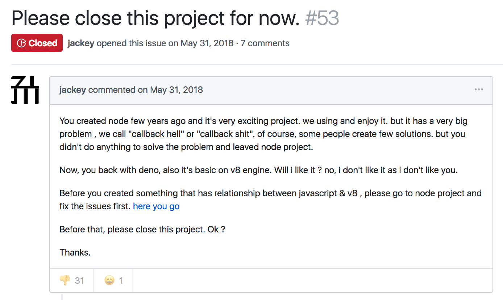

---

# Rafał Pocztarski

You may know me from Stack Overflow

[](https://stackoverflow.com/users/613198/rsp)

# pocztarski.com

Enough about me

---

# From Node.js<br>to Deno

JavaScript/TypeScript runtime<br>
built with V8 and ~~Go~~ Rust

---

evented I/O for v8 javascript

---

A secure TypeScript runtime on V8

---

# Architecture

Node = Server-side JS with V8 + libuv in C++

Deno = Server-side TS with V8 + Tokio in Rust

---

GitHub:
- [nodejs/node](https://github.com/nodejs/node) 
- [denoland/deno](https://github.com/denoland/deno) 

Stack Overflow:
- [Questions tagged 'node.js'](https://stackoverflow.com/questions/tagged/node.js): 270,111
- [Questions tagged 'deno'](https://stackoverflow.com/questions/tagged/deno): 9

---

```
$ cat hi.ts 

import { hello } from 'https://pocztarski.com/hello.ts';

hello();
```

---

```
$ deno hi.ts

Compiling file:///Users/rsp/talks/deno/git/ntd/hi.ts
Downloading https://pocztarski.com/hello.ts
Uncaught Error: Unknown media type for: "https://pocztarski.com/hello.ts" ...
```

Ups...

---

Netlify - No fix

<small>
```
$ curl https://pocztarski.com/hello.ts -I
HTTP/1.1 200 OK
Accept-Ranges: bytes
Cache-Control: public, max-age=0, must-revalidate
Content-Length: 63
Content-Type: text/vnd.trolltech.linguist; charset=UTF-8
Date: Wed, 10 Apr 2019 07:39:40 GMT
Etag: "e23f2644d8d63e564ffcba8baa758bd3-ssl"
Strict-Transport-Security: max-age=31536000
Age: 767
Connection: keep-alive
Server: Netlify
X-NF-Request-ID: 7cb5e5c1-27a3-41ef-a352-8bb94064f514-7650812
```
</small>

---

What is text/vnd.trolltech.linguist

https://www.iana.org/assignments/media-types/text/vnd.trolltech.linguist

links to:

http://doc.trolltech.com/4.1/linguist-manual.html

(domain parking page)

---

# Netlify - Bad Fix

(Not working!)

```yaml
$ cat _headers

/*.ts
  Content-type: application/x-typescript
```

---

# Deno Netlify Fix

(Working!)

```yaml
$ cat _headers 

/*.ts
  Content-Type: application/x-typescript
```

---

Netlify - Headers with bad fix

```
$ curl https://pocztarski.com/hello.ts -I
HTTP/1.1 200 OK
Accept-Ranges: bytes
Cache-Control: public, max-age=0, must-revalidate
Content-Length: 63
Content-Type: text/vnd.trolltech.linguist; charset=UTF-8
Content-Type: application/x-typescript
Date: Wed, 10 Apr 2019 09:17:01 GMT
Etag: "f9feb4d50402727c955be9cb95575ab5-ssl"
Strict-Transport-Security: max-age=31536000
Age: 2
Connection: keep-alive
Server: Netlify
X-NF-Request-ID: 7cb5e5c1-27a3-41ef-a352-8bb94064f514-8367887
```

---

Netlify - Headers with good fix

```
$ curl https://pocztarski.com/hello.ts -I
HTTP/1.1 200 OK
Accept-Ranges: bytes
Cache-Control: public, max-age=0, must-revalidate
Content-Length: 63
Content-Type: application/x-typescript
Date: Wed, 10 Apr 2019 09:19:06 GMT
Etag: "59689ad05ef50b0455a56c758821512c-ssl"
Strict-Transport-Security: max-age=31536000
Age: 0
Connection: keep-alive
Server: Netlify
X-NF-Request-ID: 7cb5e5c1-27a3-41ef-a352-8bb94064f514-8384722
```

---

求不要更新了，老子学不动了 (Issue #25)<br>
https://github.com/denoland/deno/issues/25

没钱用 肯定要学啊 不学就没有钱用 (Issue #27)<br>
https://github.com/denoland/deno/issues/27

your code very six !!! (Issue #31)<br>
https://github.com/denoland/deno/issues/31

---

Going from Go to Rust was proposed very early

<small>
Deno vs Node.js (Issue #11)<br>
https://github.com/denoland/deno/issues/11

拥抱GO 得永生 (Issue #34)<br>
(translation: Embrace GO for eternal life)<br>
https://github.com/denoland/deno/issues/34

Suggestion: Look into porting to Rust and using Tokio (Issue #205)<br>
(interesting discussion)
https://github.com/denoland/deno/issues/205
</small>


---

求你们不要在学了 我跟不上了 我也不想学了<br>
[translation: I don’t want to learn, I can’t keep up, I don’t want to learn.]

Here is NOT the chatroom, behavior yourself!<br>
请不要再灌水了，中国开发者的脸都被你们丢光了。<br>
[translation: Please don't pour any more water. The faces of Chinese developers have been lost by you.]

https://github.com/denoland/deno/issues/27<br>

---

Deno Core

https://github.com/denoland/deno 

Deno Standard Modules

https://github.com/denoland/deno_std 

---

Frameworks

- [http](https://github.com/denoland/deno_std/tree/master/http) (std) 
- [oak](https://github.com/oakserver/oak) by Kitson Kelly (Australia) 
- [dinatra](https://github.com/syumai/dinatra) by Syumai (Japan) 
- [abc](https://github.com/zhmushan/abc) by Zhmushan (China) 
- [expressive](https://github.com/jinjor/deno-playground/tree/master/expressive) by Yosuke Torii (Japan) 
- [fen](https://github.com/fen-land/deno-fen) by Dominic Ming (China) 
- [pogo](https://github.com/sholladay/pogo) by Seth Holladay (USA) 

---

Databases

- [redis](https://github.com/keroxp/deno-redis) by Yusuke Sakurai (Japan) 
- [postgres](https://github.com/bartlomieju/deno-postgres) by Bartek Iwańczuk (Poland) 
- [mysql](https://github.com/manyuanrong/deno_mysql) by EnokMan (China) 
- [Deno Simple Orm](https://github.com/manyuanrong/dso) by EnokMan (China) 

---

Packages

- https://deno.land/x/
- https://denopkg.com/
- https://deno.sh/

---

Creative feedback 

"Will i like it ? no, i don't like it as i don't like you."

<small>
Please close this project for now. (Issue #53)<br>
https://github.com/denoland/deno/issues/53
</small>

---

Deno vs ts-node

My answer on Stack Overflow for details:

[deno vs ts-node : what's the difference](https://stackoverflow.com/questions/53428120/deno-vs-ts-node-whats-the-difference/55609763#55609763)

For even more details see:

[node-ts-hello adventures](https://gist.github.com/rsp/f7d6aec4f2bbac3de4bc3f88d871cc70)

Conclusion: Deno is 32x faster on startup for a simple example.

---

???

https://cnodejs.org/topic/5b0fb21b57137f22415c47c8

---



<small>
https://github.com/denoland/deno/issues/53
</small>

---

---

Alex Hultman, author of µWebSockets - https://github.com/uNetworking - gets banned

---

# Installation<br>For the adventurous

`curl -fsSL https://deno.land/x/install/install.sh | sh`

`iwr https://deno.land/x/install/install.ps1 | iex`

<small>
The scripts above currently just scrape the GitHub releases page:<br>
https://github.com/denoland/deno/releases
</small>

---

Suggestion: Look into porting to Rust and using Tokio (Issue #205)<br>
https://github.com/denoland/deno/issues/205

---

# Current state

Not ready for production yet

<small>
(which is the best time to get involved)
</small>

---

Why it *WILL* get traction

1. Ryan Dahl (his previous project was and still is an amazing success)
2. V8 (Google will promote it)
3. TypeScript (Microsoft will promote it)
4. Rust (Mozilla will promote it)

---

My prediction

The industry will ignore it until it is "ready" and then:

- startups who provide infrastructure and tooling will get business
- people who used it "before it was cool" will get more job offers that they can read

(like it is now with Node.js)

---

# Articles

- [Fen (a simple Typescript web framework for deno)](https://medium.com/@mxz961002/fen-a-simple-typescript-web-framework-for-deno-13cfe84d270c) by 明多牧

---

Modules Registry

https://deno.land/x/

This is a redirection service

<small>
E.g. this install script URL:<br>
https://deno.land/x/install/install.sh<br>
redirects to:<br>
https://raw.githubusercontent.com/denoland/deno_install/master/install.sh
</small>

---

Cleaning the cache (on Mac)

```
rm -rvf ~/Library/Caches/deno
```

Using local caches:

```
DENO_DIR=`pwd`/.deno deno hi.ts
```

---

Bug?

```
DENO_DIR=./.deno deno hi.ts
error TS2691: An import path cannot end with a '.ts' extension.
Consider importing 'https://pocztarski.com/hello' instead.
```

---

Recommended talks

<small>
- [Ryan Dahl: Original Node.js presentation (2009)](https://www.youtube.com/watch?v=ztspvPYybIY)
- [History of Node.js by Ryan Dahl (2011)](https://www.youtube.com/watch?v=SAc0vQCC6UQ)
- [10 Things I Regret About Node.js by Ryan Dahl (2018)](https://www.youtube.com/watch?v=M3BM9TB-8yA)
- [Deno, A New Server-Side Runtime by Ryan Dahl (2018)](https://www.youtube.com/watch?v=FlTG0UXRAkE)
</small>

---

Resources

<small>
- https://denoland.org/
- https://deno.land/
- https://deno.land/manual.html
- https://deno.land/typedoc/
- https://deno.land/x/
- https://twitter.com/deno_land
- https://github.com/denoland/deno
- https://github.com/denoland/deno/releases
- https://github.com/denoland/deno/issues
- https://github.com/denoland/deno/pulls

</small>

---

# Questions?

Slides: https://pocztarski.com/ntd

## Rafał Pocztarski

## [pocztarski.com](https://pocztarski.com)

"In the original object-oriented systems that were so successful,
messages aren't commands at all. What they are are desires." - Alan Kay
